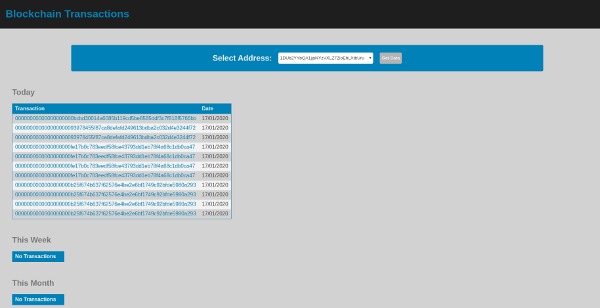

## What it Does

Start with `node server` in a terminal.

Upon loading, the frontend requests to the backend details about the default address.

The backend trims off unnecessary data, sorts in date order, groups in categories (today, last week, lasat month, etc.) and sends to the frontend.

The frontend displays a Splash screen while waiting to receive the data and proceeds to display the data in tables.

The data received is stored in `sessionStorage`.

If the user selects a new address from the dropdown, a check is made whether the data is already located in `sessionStorage`, in which case it is loaded from `sessionStorage`.

If not, a request is made to backend, and the received data is stored to `sessionStorage` too.

On clicking a transaction, the user is taken to another 'page', but without any reloading.

Transactions details are requested to backend, and the details page is populated accordingly.

Frontend is responsive to different screen sizes.

## Issues

### Fetching Transaction Details

I kept getting errors when trying to fetch transaction details from the blockcypher api.

Probably I am picking the wrong hash due to my lack of knowledge in blockchain, e.g.:

`error: 'Transaction 00000000000000000010653b10c8dcf3d18eed2dac60dace178b509b70d27e10 not found' `

So, just for presentation purposes, I hard-coded the 'transaction-details', and always send the same details back to frontend.
